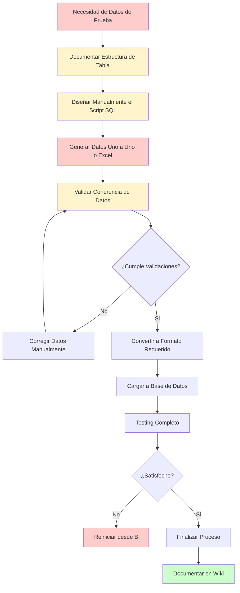
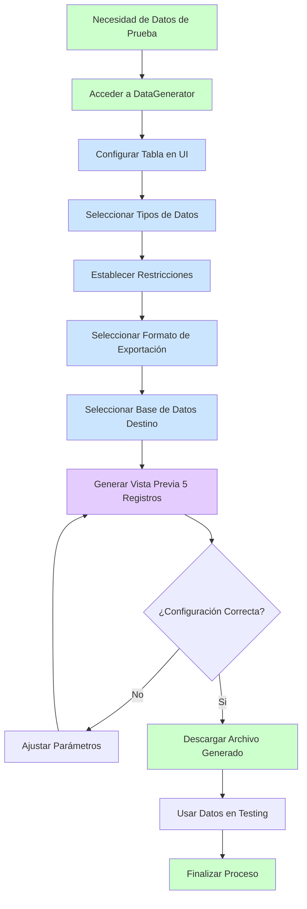
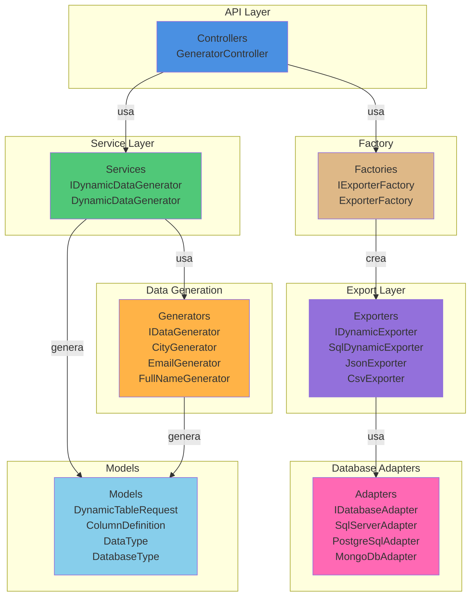
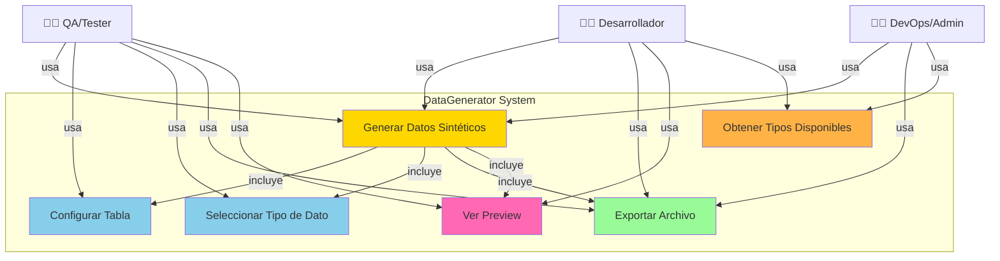
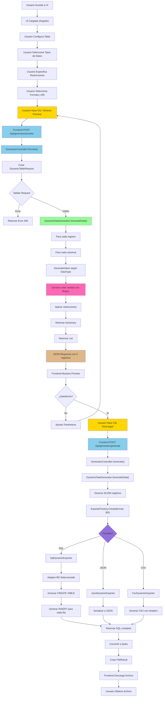
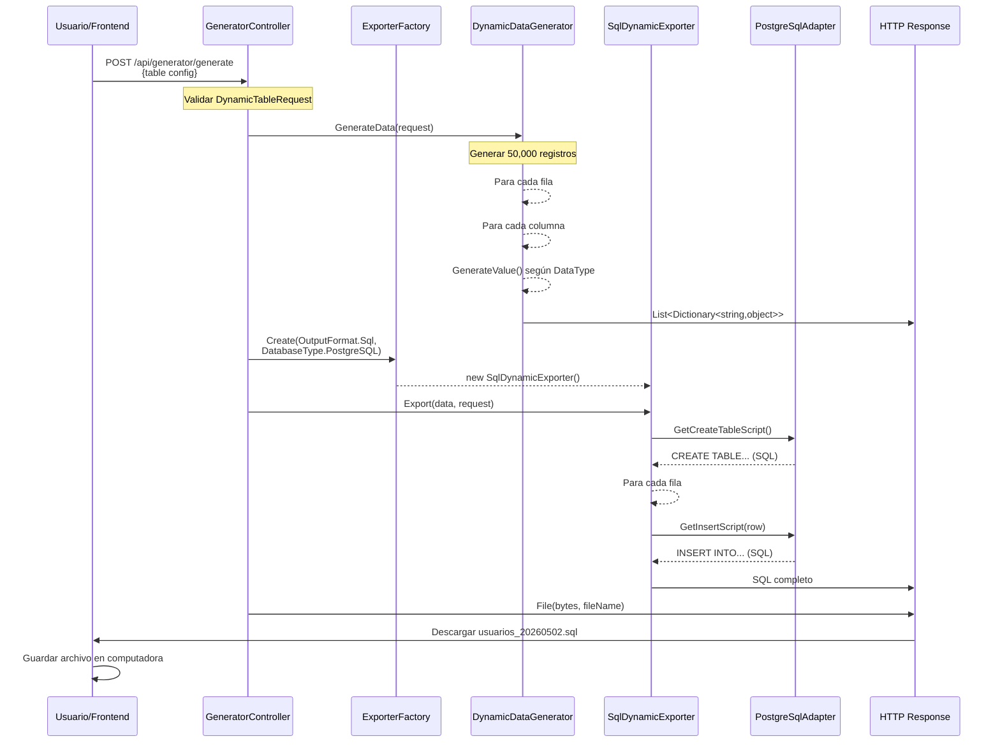
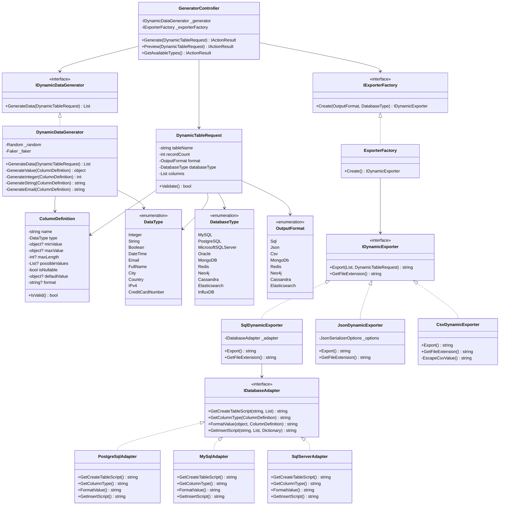

{width="1.0879997812773403in" height="1.4625557742782151in"}

# UNIVERSIDAD PRIVADA DE TACNA

## FACULTAD DE INGENIERIA

### Escuela Profesional de Ingeniería de Sistemas

---

# Proyecto: Sistema Generador de Datos Sintéticos (DataGenerator)

**Curso:** Análisis y Diseño de Sistemas de Información

**Docente:** Ing. Patrick Cuadros

**Integrantes:**

- Ramos Loza, Mariela Estefany (2023077478)
- Calloticona Chambilla, Marymar Danytza (2023076791)

**Tacna -- Perú**

**2026**

---

## CONTROL DE VERSIONES

| Versión | Hecha por | Revisada por | Aprobada por | Fecha | Motivo |
|---------|-----------|--------------|--------------|-------|--------|
| 1.0 | MPV | ELV | ARV | 02/05/2026 | Versión Original |

---

# Sistema DataGenerator

## Documento de Especificación de Requerimientos de Software

**Versión 1.0**

---

## CONTROL DE VERSIONES (SRS)

| Versión | Hecha por | Revisada por | Aprobada por | Fecha | Motivo |
|---------|-----------|--------------|--------------|-------|--------|
| 1.0 | MPV | ELV | ARV | 02/05/2026 | Versión Original |

---

## ÍNDICE GENERAL

1. [INTRODUCCIÓN](#introducción)
2. [I. GENERALIDADES DE LA EMPRESA](#i-generalidades-de-la-empresa)
   - [1. Nombre de la Empresa](#1-nombre-de-la-empresa)
   - [2. Visión](#2-visión)
   - [3. Misión](#3-misión)
   - [4. Organigrama](#4-organigrama)
3. [II. VISIONAMIENTO DE LA EMPRESA](#ii-visionamiento-de-la-empresa)
   - [1. Descripción del Problema](#1-descripción-del-problema)
   - [2. Objetivos de Negocios](#2-objetivos-de-negocios)
   - [3. Objetivos de Diseño](#3-objetivos-de-diseño)
   - [4. Alcance del Proyecto](#4-alcance-del-proyecto)
   - [5. Viabilidad del Sistema](#5-viabilidad-del-sistema)
   - [6. Información Obtenida del Levantamiento de Información](#6-información-obtenida-del-levantamiento-de-información)
4. [III. ANÁLISIS DE PROCESOS](#iii-análisis-de-procesos)
5. [IV. ESPECIFICACIÓN DE REQUERIMIENTOS DE SOFTWARE](#iv-especificación-de-requerimientos-de-software)
6. [V. FASE DE DESARROLLO](#v-fase-de-desarrollo)
7. [CONCLUSIONES](#conclusiones)
8. [RECOMENDACIONES](#recomendaciones)
9. [REFERENCIAS BIBLIOGRÁFICAS](#referencias-bibliográficas)

---

# INTRODUCCIÓN

El presente documento especifica los requerimientos de software para el **Sistema de Generación de Datos Sintéticos (DataGenerator)**, una solución integral diseñada para automatizar la generación de volúmenes significativos de datos de prueba coherentes y realistas.

En la actualidad, las organizaciones enfrentan desafíos importantes en el desarrollo y testing de aplicaciones que requieren grandes volúmenes de datos. Los problemas principales incluyen:

- **Falta de datos de prueba realistas:** La mayoría de proyectos carecen de datos de prueba válidos y coherentes
- **Privacidad y seguridad:** Utilizar datos reales de producción en desarrollo viola normativas de protección de datos
- **Tiempo y recursos:** La creación manual de datos de prueba es tediosa y propensa a errores
- **Escalabilidad:** Difícil generar millones de registros manualmente para pruebas de rendimiento

DataGenerator ofrece una solución completa y escalable que permite a desarrolladores, testers y analistas generar rápidamente datos sintéticos configurables para múltiples bases de datos y formatos.

---

# I. GENERALIDADES DE LA EMPRESA

## 1. Nombre de la Empresa

**TechData Solutions** es una empresa especializada en soluciones de software para gestión de datos y pruebas de aplicaciones. Opera en el sector de tecnología de la información con enfoque en herramientas de desarrollo y QA.

## 2. Visión

Ser la plataforma líder en generación de datos sintéticos, permitiendo que desarrolladores y testers de todo el mundo creen datos de prueba realistas, seguros y escalables para acelerar el desarrollo de software de calidad.

## 3. Misión

Proporcionar soluciones innovadoras y eficientes para la generación de datos de prueba que garanticen:
- Calidad en el desarrollo de software
- Cumplimiento normativo en protección de datos
- Reducción de tiempos y costos en testing
- Seguridad de datos sensibles

## 4. Organigrama

```
                    Dirección General
                           |
                           |
        ___________________|___________________
       |                   |                   |
   Gerencia de        Gerencia de          Gerencia de
   Desarrollo        Operaciones           Ventas y Marketing
       |                   |                   |
       |                   |                   |
  - Lead Dev          - DevOps              - Ejecutivos
  - Developers        - QA Lead             - Sales Team
  - Testers           - QA Engineers       - Marketing
```

---

# II. VISIONAMIENTO DE LA EMPRESA

## 1. Descripción del Problema

### Situación Actual

En la industria del desarrollo de software, existe una brecha crítica en la disponibilidad de datos de prueba:

**Problemas Identificados:**

1. **Generación Manual de Datos:**
   - Proceso tedioso y propenso a errores
   - Requiere muchas horas de trabajo manual
   - Difícil mantener consistencia y coherencia

2. **Privacidad y Seguridad:**
   - Usar datos reales de producción en desarrollo viola GDPR, HIPAA y otras normativas
   - Riesgo de exposición de información sensible
   - Cumplimiento complejo y costoso

3. **Escalabilidad:**
   - Generar millones de registros manualmente es prácticamente imposible
   - Necesario para pruebas de rendimiento y carga
   - Las herramientas existentes son limitadas y costosas

4. **Compatibilidad:**
   - Diferentes bases de datos requieren formatos distintos
   - Necesidad de convertir datos para múltiples plataformas
   - Falta de herramientas unificadas

5. **Relaciones entre Datos:**
   - Datos deben ser coherentes y tener relaciones válidas
   - Información debe ser realista y utilizable
   - Validaciones complejas difíciles de implementar

### Impacto Empresarial

- ⏱️ Aumento en ciclos de desarrollo
- 💰 Incremento de costos por horas invertidas
- ⚠️ Riesgos de seguridad y cumplimiento normativo
- 📉 Reducción en eficiencia de testing
- 🔒 Exposición a brechas de seguridad

## 2. Objetivos de Negocios

### Objetivos Generales

1. **Automatizar la generación de datos de prueba:**
   - Reducir tiempo de preparación de datos en 80%
   - Minimizar intervención manual
   - Permitir generación de millones de registros en minutos

2. **Garantizar cumplimiento normativo:**
   - Eliminar necesidad de datos reales en desarrollo
   - Cumplir con GDPR, HIPAA, PCI-DSS
   - Implementar auditoría completa de generaciones

3. **Soportar múltiples plataformas:**
   - Compatibilidad con 10+ bases de datos diferentes
   - Exportación a múltiples formatos (SQL, JSON, CSV, etc.)
   - Escalabilidad empresarial

4. **Mejorar calidad de testing:**
   - Datos realistas y coherentes
   - Cobertura completa de casos de prueba
   - Validación automática

### Objetivos Específicos

- Reducir tiempo de setup de datos de test de horas a minutos
- Permitir generación de 50,000+ registros por solicitud
- Soportar 22+ tipos de datos semánticos
- Exportar a 10 formatos diferentes
- Lograr 99.5% de disponibilidad del sistema
- Reducir costos operativos en 60%

## 3. Objetivos de Diseño

1. **Interfaz Intuitiva:**
   - UI moderna y fácil de usar
   - No requiere conocimiento técnico avanzado
   - Configuración visual de columnas y tipos de datos

2. **Arquitectura Escalable:**
   - Backend basado en microservicios
   - Procesamiento paralelo de generación
   - Caching inteligente de datos

3. **Flexibilidad:**
   - Generadores personalizables
   - Reglas de negocio configurables
   - Extensible para nuevas bases de datos y formatos

4. **Rendimiento:**
   - Generación optimizada de millones de registros
   - Exportación eficiente
   - Respuestas rápidas (< 5s para 50k registros)

5. **Seguridad:**
   - Validación de entrada estricta
   - Encriptación de datos en tránsito
   - Auditoría completa de operaciones

## 4. Alcance del Proyecto

### Incluido en el Proyecto

✅ **Funcionalidad Principal:**
- Generador dinámico de datos sintéticos
- 22+ tipos de datos semánticos
- 10 bases de datos soportadas
- 8 formatos de exportación

✅ **Componentes:**
- API REST completa (.NET 8)
- Interfaz web (Angular 18+)
- Factory pattern para extensibilidad
- Sistema de adaptadores por BD

✅ **Características:**
- Vista previa de 5 registros
- Validación de restricciones
- Generación masiva (hasta 50,000 registros)
- Descarga directa de archivos

✅ **Garantías:**
- Datos realistas mediante Bogus
- CORS habilitado
- Documentación Swagger completa

### No Incluido en el Proyecto

❌ **Fuera de Alcance:**
- Sincronización directa con BD (solo exportación)
- Generación de esquemas complejos con relaciones
- Soporte para stored procedures
- Sistema de usuarios y autenticación (MVP)
- Historial de generaciones (para versión 2.0)
- Analytics avanzados

### Limites y Restricciones

- Máximo 50,000 registros por solicitud
- Máximo 100 columnas por tabla
- Tipos de datos limitados a 22 categorías
- Sin persistencia de configuraciones (MVP)
- Timeout de 60 segundos por generación

## 5. Viabilidad del Sistema

### Viabilidad Técnica ✅

**Muy Viable**
- Tecnologías maduras (.NET 8, Angular 18)
- Librerías probadas (Bogus para data generation)
- Arquitectura estándar y bien conocida
- No requiere infraestructura especial

**Estimación:**
- Desarrollo: 6-8 semanas
- Testing: 2 semanas
- Deployment: 1 semana

### Viabilidad Económica ✅

**Rentable**
- Costo de desarrollo: Bajo (stack popular)
- ROI alto: reduce costos de testing en 60%
- Licencias: Todas herramientas son open source o enterprise
- Infraestructura: Cloud estándar

**Modelo de ingresos:**
- SaaS: $49-299/mes según volumen
- Licencia perpetua: $999-4999
- Empresa: Pricing personalizado

### Viabilidad Operativa ✅

**Mantenible**
- Código limpio y bien documentado
- Fácil de escalar horizontalmente
- Despliegue sencillo en Docker/Kubernetes
- Soporte 24/7 es viable

---

## 6. Información Obtenida del Levantamiento de Información

### Fuentes de Información

1. **Análisis de Competencia:**
   - Herramientas existentes: Mockaroo, Generatedata.com, SQL Server Data Tools
   - Gaps identificados: Poca automatización, interfaces complejas, costo alto

2. **Entrevistas con Stakeholders:**
   - Necesidad de soporte para múltiples BD
   - Preferencia por interfaz web intuitiva
   - Crítico: generación rápida y masiva

3. **Revisión de Procesos:**
   - Tiempo actual de preparación: 4-8 horas por proyecto
   - Cantidad de tipos de datos requeridos: 20+
   - Formato de exportación más usado: SQL

4. **Benchmarking:**
   - Rendimiento esperado: > 100k registros/minuto
   - Disponibilidad: 99.5%
   - Latencia aceptable: < 5 segundos

### Requisitos del Cliente

1. Soporte para bases de datos: MySQL, PostgreSQL, SQL Server, Oracle, MongoDB, Redis, Neo4j, Cassandra, Elasticsearch, InfluxDB
2. Tipos de datos: Persona (nombre, email), Ubicación (ciudad, país), Finanzas (tarjetas), Contacto, etc.
3. Formatos: SQL ejecutable, JSON, CSV, comandos específicos de BD
4. Interfaz intuitiva para no-técnicos
5. Exportación directa descargable

---

# III. ANÁLISIS DE PROCESOS

## a) Diagrama del Proceso Actual - Diagrama de Actividades



**Problemas Identificados en Proceso Actual:**

- ⏱️ **Tiempo:** 4-8 horas por tabla
- 👤 **Esfuerzo Manual:** Altamente manual y repetitivo
- ⚠️ **Errores:** Datos inconsistentes y validaciones incorrectas
- 🔄 **Iteraciones:** Múltiples ciclos de corrección
- 💾 **Documentación:** Manual y propensa a desactualización

---

## b) Diagrama del Proceso Propuesto - Diagrama de Actividades



**Mejoras en Proceso Propuesto:**

- ⚡ **Tiempo:** Reducción a 5-10 minutos
- 🤖 **Automatización:** 95% automático
- ✅ **Precisión:** Validación automática de datos
- 🔄 **Iteraciones:** Máximo 2-3 ajustes rápidos
- 💾 **Reproducibilidad:** Guardar configuraciones

---

# IV. ESPECIFICACIÓN DE REQUERIMIENTOS DE SOFTWARE

## a) Cuadro de Requerimientos Funcionales Inicial

| ID | Requerimiento | Descripción | Prioridad | Estado |
|---|---|---|---|---|
| RF001 | Generación de Datos | Sistema debe generar datos sintéticos según configuración | ALTA | Aprobado |
| RF002 | Múltiples Tipos de Datos | Soportar 20+ tipos de datos (nombre, email, ciudad, etc.) | ALTA | Aprobado |
| RF003 | Múltiples BD | Soportar 8+ bases de datos diferentes | ALTA | Aprobado |
| RF004 | Exportación | Exportar a múltiples formatos (SQL, JSON, CSV) | ALTA | Aprobado |
| RF005 | Interfaz Web | Proveer UI intuitiva para configuración | MEDIA | Aprobado |
| RF006 | Vista Previa | Mostrar preview de 5 registros antes de generar | MEDIA | Aprobado |
| RF007 | Descarga | Permitir descarga directa de archivos | ALTA | Aprobado |
| RF008 | Validaciones | Validar restricciones (min, max, longitud) | MEDIA | Aprobado |
| RF009 | API REST | Proveer API para integración | MEDIA | Aprobado |
| RF010 | Documentación | Documentación Swagger de API | MEDIA | Aprobado |

---

## b) Cuadro de Requerimientos No Funcionales

| ID | Requerimiento | Descripción | Métrica | Prioridad |
|---|---|---|---|---|
| RNF001 | Rendimiento | Generar 50,000 registros en < 5s | 10k registros/segundo | ALTA |
| RNF002 | Escalabilidad | Soportar 1,000+ usuarios concurrentes | Horizontal scaling | ALTA |
| RNF003 | Disponibilidad | Sistema disponible 99.5% del tiempo | 99.5% uptime | ALTA |
| RNF004 | Seguridad | Validación de entrada estricta | 0 vulnerabilidades OWASP | ALTA |
| RNF005 | Usabilidad | Interfaz comprensible sin capacitación | SUS score > 80 | MEDIA |
| RNF006 | Compatibilidad | Compatible con navegadores modernos | Chrome, Firefox, Safari, Edge | MEDIA |
| RNF007 | Mantenibilidad | Código limpio y bien documentado | Code coverage > 80% | MEDIA |
| RNF008 | Portabilidad | Deployable en Docker/Kubernetes | Múltiples plataformas | MEDIA |
| RNF009 | Extensibilidad | Fácil agregar nuevos tipos de datos | < 1 hora por nuevo tipo | MEDIA |
| RNF010 | Recuperación | RTO < 1 hora, RPO < 15 min | Backup automático c/15min | BAJA |

---

## c) Cuadro de Requerimientos Funcionales Final

| ID | Requerimiento | Descripción Detallada | Módulo | Estado |
|---|---|---|---|---|
| RF001 | Generación de Datos Dinámicos | El sistema genera automáticamente datos sintéticos coherentes según configuración de columnas y tipos de datos. Soporta opciones como min/max, nullable, valores por defecto. | Generador | Implementado ✅ |
| RF002 | 22+ Tipos de Datos Semánticos | Implementar tipos: Integer, String, Boolean, DateTime, Email, FullName, City, Country, CreditCard, IPv4, URL, CompanyName, ProductName, Price, Phone, etc. Cada tipo genera datos realistas. | Generador | Implementado ✅ |
| RF003 | Soporte 10 Bases de Datos | Adaptadores para: MySQL, PostgreSQL, SQL Server, Oracle, MongoDB, Redis, Neo4j, Cassandra, Elasticsearch, InfluxDB. Cada uno con su sintaxis SQL/NoSQL específica. | Adaptadores | Implementado ✅ |
| RF004 | 8 Formatos de Exportación | Exportar como: SQL ejecutable, JSON, CSV, comandos MongoDB, Redis, Neo4j, Cassandra, Elasticsearch. Formato automático según BD seleccionada. | Exportadores | Implementado ✅ |
| RF005 | Interfaz Web Intuitiva | Angular UI con: agregar/eliminar columnas dinámicamente, selector de tipos, entrada de restricciones, preview en vivo, descarga directa. Responsive design. | Frontend | Implementado ✅ |
| RF006 | Generación de Vista Previa | Endpoint /preview genera 5 registros sin descargar. Valida configuración antes de generar toda la tabla. Respuesta en JSON con metadata. | API | Implementado ✅ |
| RF007 | Descarga de Archivos | Generador crea archivo descargable con nombre automático (tabla_timestamp.sql/json/csv). HTTP Content-Disposition para descarga directa. | API | Implementado ✅ |
| RF008 | Validaciones de Restricciones | Validar: RecordCount 1-50,000, Min/Max para números, MaxLength para strings, Nullable probability 10%, columnas requeridas. Mensajes de error claros. | API | Implementado ✅ |
| RF009 | API REST Documentada | Endpoints: POST /generate, GET /types, POST /preview. Swagger documentation completa. CORS habilitado. Respuestas JSON estándar. | API | Implementado ✅ |
| RF010 | Factory Pattern para Exportadores | Sistema dinámico que selecciona exportador correcto según OutputFormat y DatabaseType sin hardcoding. Fácil agregar nuevos. | Arquitectura | Implementado ✅ |
| RF011 | Inyección de Dependencias | Servicios registrados en Program.cs. Bajo acoplamiento. Fácil testing y mantenimiento. IDynamicDataGenerator, IExporterFactory. | Arquitectura | Implementado ✅ |
| RF012 | Generadores Específicos | CityGenerator, EmailGenerator, FullNameGenerator, CreditCardGenerator, IPv4Generator con opciones configurables. Usa Bogus para datos realistas. | Generador | Implementado ✅ |
| RF013 | Validación de Entrada Estricta | Validar: tabla no vacía, columnas requeridas, tipos válidos, restricciones coherentes. Prevenir inyección SQL en formatos. | API | Implementado ✅ |
| RF014 | Respuesta Swagger | Auto-generación de documentación Swagger. Modelos tipados en C# traducidos a JSON Schema. | API | Implementado ✅ |

---

## d) Reglas de Negocio

### Reglas Generales

**RN001 - Generación de Datos Coherentes**
```
Cada dato generado debe ser:
✓ Válido según su tipo (ej: email con formato correcto)
✓ Dentro de restricciones especificadas (min, max, longitud)
✓ Realista y usable (no valores genéricos)
✓ Reproducible si se necesita regenerar
```

**RN002 - Valores Nulos Controlados**
```
Para columnas nullable:
- 10% de probabilidad de ser NULL
- Resto 90% contiene valor válido
- NULL se representa según BD (NULL en SQL, null en JSON)
```

**RN003 - Validación de Tabla**
```
Tabla válida requiere:
✓ Nombre no vacío (1-100 caracteres)
✓ Al menos 1 columna
✓ Máximo 100 columnas
✓ Nombre única por columna
✓ RecordCount entre 1 y 50,000
```

**RN004 - Tipos de Datos Permitidos**
```
Solo los siguientes tipos pueden ser generados:
- Básicos: Integer, Decimal, String, Boolean, DateTime
- Semánticos: Email, FullName, City, Country, IPv4, etc.
- No permitir tipos indefinidos
- Generar error si tipo no existe
```

**RN005 - Restricciones por Tipo**
```
Integer:
- MinValue, MaxValue válidas
- Por defecto: -2,147,483,648 a 2,147,483,647

String:
- MaxLength: 1-MAX (validar coherencia)
- PossibleValues: si se proporciona, solo usar esos valores

DateTime:
- Rango válido: 1900-2099
- Formato: yyyy-MM-dd HH:mm:ss

Decimal:
- MinValue, MaxValue con 2 decimales
- Precision: 10,2 (SQL)
```

### Reglas de Bases de Datos

**RN006 - Compatibilidad de Tipos por BD**
```
Cada BD mapea tipos al suyo:
- SQL Server: INT, NVARCHAR, DATETIME2
- PostgreSQL: INTEGER, VARCHAR, TIMESTAMP
- MongoDB: Number, String, Date
- Redis: Strings, Hashes

ERROR si tipo no soportado en BD seleccionada
```

**RN007 - Escapado de Valores**
```
Valores se escapan según BD:
- SQL: Reemplazar ' por '' en strings
- JSON: Caracteres especiales escapados
- CSV: Valores con coma encerrados en comillas
- Neo4j: Caracteres Unicode manejados correctamente
```

**RN008 - Sintaxis SQL Correcta**
```
SQL generado debe:
✓ Ser ejecutable directamente
✓ Incluir CREATE TABLE si aplica
✓ Incluir INSERT correcto por BD
✓ Usar tipos correctos para BD
✓ No superar límite de statement size
```

### Reglas de Exportación

**RN009 - Formatos de Exportación**
```
SQL:
- CREATE TABLE + INSERT INTO
- Comentarios con metadata
- Validar sintaxis por BD

JSON:
- Array de objetos
- camelCase para propiedades
- Metadata (tabla, count, fecha)

CSV:
- Headers como primera fila
- Valores escapados correctamente
- UTF-8 encoding

BD-Específico:
- Comandos nativos (MongoDB insert, Redis SET)
- Formato bulk si aplica
```

**RN010 - Nombre de Archivo**
```
Formato: {tableName}_{yyyyMMdd_HHmmss}.{ext}
- tableName: sin espacios, máx 50 caracteres
- timestamp: fecha/hora actual
- ext: .sql, .json, .csv, .txt según formato

Ejemplo: usuarios_20260502_143025.sql
```

**RN011 - Máximo de Registros por Solicitud**
```
- Mínimo: 1 registro
- Máximo: 50,000 registros
- Justificación: limitar uso de memoria/CPU
- Permitir múltiples solicitudes para más datos
```

### Reglas de Validación de Entrada

**RN012 - Validación de Columnas**
```
Cada columna requiere:
✓ name: string 1-100 caracteres
✓ type: debe existir en enum DataType
✓ minValue/maxValue: coherentes (min <= max)
✓ maxLength: positivo si se proporciona
✓ possibleValues: lista no vacía si se proporciona

ERROR si alguno no cumple
```

**RN013 - Validación de RecordCount**
```
- Tipo: integer positivo
- Mínimo: 1
- Máximo: 50,000
- Por defecto: 100 si no se proporciona
- ERROR si fuera de rango
```

**RN014 - Validación de Formato y BD**
```
- OutputFormat: debe existir en enum
- DatabaseType: debe existir en enum
- Por defecto: SQL y MySQL
- ERROR si valores inválidos
```

### Reglas de Generación Específicas

**RN015 - Generación de Email**
```
- Formato: nombre@dominio.com
- Dominio realista
- Único por sesión (sin duplicados en misma tabla)
- Cumplir RFC 5322
```

**RN016 - Generación de Nombres Completos**
```
- Formato: Nombre Apellido
- Datos culturales realistas (usar Faker con locale es_ES)
- Longitud típica: 20-50 caracteres
- Puede incluir prefijo (Sr., Dra.) si aplica
```

**RN017 - Generación de Direcciones IP**
```
IPv4:
- Rango válido: 0.0.0.0 a 255.255.255.255
- Excluir rangos reservados si aplica
- Formato: XXX.XXX.XXX.XXX

IPv6:
- Formato válido según RFC 4291
```

**RN018 - Generación de Fechas**
```
- DateTime: últimos 5 años hasta hoy
- Date: formato según BD (YYYY-MM-DD)
- Time: formato según BD (HH:mm:ss)
- Valores realistas (no futuro por defecto)
```

**RN019 - Reproducibilidad (Opcional para Futuro)**
```
- Guardar seed de generación
- Permitir regenerar exactos datos si mismo seed
- Útil para debugging y testing consistente
```

---

# V. FASE DE DESARROLLO

## 1. Perfiles de Usuario

### Perfil 1: Desarrollador de Software

**Información General:**
- Edad: 25-40 años
- Experiencia: 3-10 años en desarrollo
- Conocimiento Técnico: Alto
- Frecuencia de Uso: Diaria

**Necesidades:**
- Generar datos rápidamente para testing
- Exportar a múltiples formatos
- Integrar con CI/CD pipelines
- API programática
- Datos realistas y coherentes

**Comportamiento:**
- Prefiere interfaz intuitiva pero con opciones avanzadas
- Valora velocidad de generación
- Necesita reproducibilidad
- Usa múltiples bases de datos

**Objetivos:**
- Reducir tiempo de setup de test data
- Automatizar generación
- Mejorar cobertura de casos de prueba

---

### Perfil 2: QA/Tester

**Información General:**
- Edad: 23-45 años
- Experiencia: 2-8 años en QA
- Conocimiento Técnico: Medio
- Frecuencia de Uso: Varias veces por semana

**Necesidades:**
- Generar datos variados para pruebas
- No requiere conocimiento técnico profundo
- Interfaz gráfica clara y simple
- Exportación a formatos comunes (SQL, CSV)
- Configuración preestablecida

**Comportamiento:**
- Prefiere UI visual y click-based
- Requiere ayuda/tooltips
- Necesita documentación clara
- Quiere resultados rápidos

**Objetivos:**
- Crear datasets para pruebas funcionales
- Validar comportamiento con datos variados
- Acelerar ciclos de testing

---

### Perfil 3: DevOps / DBA

**Información General:**
- Edad: 28-50 años
- Experiencia: 5-15 años infraestructura
- Conocimiento Técnico: Muy Alto
- Frecuencia de Uso: Ocasional

**Necesidades:**
- Generar datos para múltiples BD
- Exportación en formatos de BD específicos
- Integración con sistemas existentes
- API REST para automatización
- Escalabilidad y rendimiento

**Comportamiento:**
- Prefiere API programática
- Entiende complejidades técnicas
- Necesita documentación técnica
- Valora performance y confiabilidad

**Objetivos:**
- Automatizar generación de datos
- Integrar en pipelines de infraestructura
- Asegurar disponibilidad de datos de prueba

---

### Perfil 4: Project Manager / Analista

**Información General:**
- Edad: 30-55 años
- Experiencia: 5-20 años gestión
- Conocimiento Técnico: Bajo-Medio
- Frecuencia de Uso: Muy Ocasional

**Necesidades:**
- Entender estado del proyecto
- Reportes de generación
- Control de recursos
- Métricas de uso

**Comportamiento:**
- Prefiere reportes visuales
- Necesita información de alto nivel
- No requiere detalles técnicos
- Requiere visibilidad general

**Objetivos:**
- Monitorear progreso del proyecto
- Justificar inversión en herramienta
- Asegurar recursos disponibles

---

## 2. Modelo Conceptual

### a) Diagrama de Paquetes



---

### b) Diagrama de Casos de Uso



---

### c) Escenarios de Caso de Uso (Narrativa)

#### **Caso de Uso 1: Generar Datos Sintéticos**

**ID:** UC001

**Nombre:** Generar Datos Sintéticos

**Actor Principal:** Desarrollador / QA

**Precondiciones:**
- Sistema DataGenerator disponible
- Usuario acceso a interfaz web
- Navegador moderno con JavaScript habilitado

**Flujo Básico:**

1. Actor inicia sesión en DataGenerator
2. Sistema muestra página principal con formulario vacío
3. Actor ingresa nombre de tabla: "usuarios"
4. Sistema valida nombre (no vacío, caracteres válidos)
5. Actor especifica número de registros: 1000
6. Sistema valida RecordCount (1-50,000)
7. Actor selecciona formato de exportación: "SQL"
8. Sistema carga BD soportadas para SQL
9. Actor selecciona BD: "PostgreSQL"
10. Sistema habilita tipos de datos compatibles
11. Actor agrega 3 columnas:
    - id: Integer (min: 1, max: 100000)
    - email: Email
    - nombre: FullName
12. Sistema valida cada columna
13. Actor hace clic "Generar Vista Previa"
14. Sistema genera 5 registros y los muestra en JSON
15. Actor revisa preview y aprueba
16. Actor hace clic "Descargar"
17. Sistema genera 1000 registros completos
18. Sistema exporta a SQL PostgreSQL
19. Sistema crea archivo: usuarios_20260502_143025.sql
20. Sistema inicia descarga automática

**Flujo Alternativo 1: Validación Falla**

6a. RecordCount > 50,000
- Sistema muestra error: "Máximo 50,000 registros"
- Actor corrige valor
- Continúa en paso 7

**Flujo Alternativo 2: Columna Incompleta**

11a. Actor no especifica nombre de columna
- Actor intenta continuar
- Sistema muestra error: "Nombre de columna requerido"
- Actor ingresa nombre
- Continúa en paso 12

**Flujo Alternativo 3: Vista Previa Insatisfactoria**

15a. Actor no aprueba preview
- Actor modifica parámetros
- Actor vuelve al paso 13
- Sistema genera nueva preview con nuevos parámetros

**Postcondiciones:**
- Archivo descargado en computadora del usuario
- Usuario puede usar datos en su testing
- Registro de generación guardado en logs del sistema

**Requisitos No Funcionales Aplicables:**
- RNF001: Generación debe ser rápida (< 5s)
- RNF002: Sistema debe soportar múltiples usuarios simultáneos
- RNF006: UI debe ser compatible con navegadores modernos

---

#### **Caso de Uso 2: Configurar Tabla Dinámicamente**

**ID:** UC002

**Nombre:** Configurar Tabla Dinámicamente

**Actor Principal:** QA / Desarrollador

**Precondiciones:**
- Usuario está en página de generación
- Formulario iniciado

**Flujo Básico:**

1. Sistema muestra tabla con 0 columnas iniciales
2. Actor hace clic botón "+ Agregar Columna"
3. Sistema agrega fila vacía a tabla
4. Actor ingresa nombre: "id"
5. Sistema valida (alphanumeric, no espacios)
6. Actor selecciona tipo: "Integer" en dropdown
7. Sistema muestra opciones numéricas: min, max
8. Actor ingresa min: 1
9. Actor ingresa max: 10000
10. Sistema valida (min <= max)
11. Actor marca checkbox "Requerido" (no nullable)
12. Actor hace clic "+ Agregar Columna"
13. Pasos 3-11 repetidos para "email" (tipo Email)
14. Pasos 3-11 repetidos para "activo" (tipo Boolean)
15. Actor revisa configuración completa
16. Actor continúa con generación

**Flujo Alternativo 1: Eliminar Columna**

13a. Actor hace clic botón "X" en fila de columna
- Sistema elimina fila
- Actor confirma eliminación
- Tabla actualizada sin esa columna
- Continúa en paso 15

**Flujo Alternativo 2: Modificar Tipo de Dato**

7a. Actor cambia tipo de String a Integer
- Sistema limpia opciones anteriores (MaxLength)
- Sistema muestra nuevas opciones (Min, Max)
- Continúa en paso 8

**Postcondiciones:**
- Tabla configurada con X columnas
- Cada columna tiene tipo y restricciones
- Listo para generar datos

---

#### **Caso de Uso 3: Exportar a Múltiples Formatos**

**ID:** UC003

**Nombre:** Exportar a Múltiples Formatos

**Actor Principal:** Desarrollador / DevOps

**Precondiciones:**
- Datos generados exitosamente
- Usuario selecciona formato de exportación

**Flujo Básico:**

1. Actor selecciona formato: "SQL"
2. Sistema habilita opciones de BD relacionadas
3. Actor selecciona: "MySQL"
4. Sistema genera SQL con sintaxis MySQL:
   - CREATE TABLE con tipos MySQL
   - INSERT INTO con format MySQL
5. Usuario descarga archivo .sql

**Flujo Alternativo 1: Exportar a JSON**

1a. Actor selecciona formato: "JSON"
- Sistema genera JSON estructurado
- Incluye metadata (nombre tabla, cantidad registros, fecha)
- Archivo con extension .json
- Usuario descarga

**Flujo Alternativo 2: Exportar a CSV**

1b. Actor selecciona formato: "CSV"
- Sistema genera CSV con headers
- Valores escapados correctamente
- Archivo con extension .csv
- Usuario descarga

**Flujo Alternativo 3: Exportar para MongoDB**

1c. Actor selecciona formato: "MongoDB"
- Sistema genera array de documentos JSON
- Compatible con MongoDB import
- Archivo con extension .json
- Usuario descarga

**Postcondiciones:**
- Archivo descargado en formato seleccionado
- Datos listos para usar en BD o aplicación
- Archivo utilizable directamente

---

#### **Caso de Uso 4: Ver Vista Previa de Datos**

**ID:** UC004

**Nombre:** Ver Vista Previa de Datos

**Actor Principal:** QA / Desarrollador

**Precondiciones:**
- Tabla configurada
- Usuario solicita preview

**Flujo Básico:**

1. Actor hace clic botón "👁️ Preview"
2. Sistema genera 5 registros con configuración actual
3. Sistema muestra tabla HTML con 5 filas
4. Actor revisa datos generados:
   - IDs varían entre 1-10000
   - Emails son válidos
   - Nombres son realistas
5. Actor decide:
   - A: Continuar con configuración (ir al paso 6)
   - B: Ajustar configuración (volver a configuración)

**Flujo Alternativo 1: Validación Falla**

2a. Sistema detecta error en configuración
- Sistema muestra error específico
- Actor corrige (ej: max < min)
- Sistema recalcula preview

**Postcondiciones:**
- Usuario ha visto muestra de datos
- Usuario decide si continuar o ajustar
- Preview es indicativo del resultado final

---

#### **Caso de Uso 5: Obtener Tipos de Datos Disponibles**

**ID:** UC005

**Nombre:** Obtener Tipos de Datos Disponibles

**Actor Principal:** Sistema / Desarrollador (API)

**Precondiciones:**
- Usuario accede a endpoint /api/generator/types

**Flujo Básico:**

1. Sistema recibe GET /api/generator/types
2. Sistema enumera todos valores de DataType
3. Sistema devuelve JSON con lista:
   ```json
   [
     {"name": "Integer", "value": 0},
     {"name": "String", "value": 1},
     {"name": "Email", "value": 2},
     ...
   ]
   ```
4. Cliente (UI) recibe y popula dropdowns

**Postcondiciones:**
- UI tiene lista actualizada de tipos
- Dropdowns mostrados con todas opciones disponibles
- Usuario puede seleccionar cualquier tipo

---

## 3. Modelo Lógico

### a) Análisis de Objetos

#### **Clase: DynamicTableRequest**

**Responsabilidad:** Encapsular solicitud completa de generación

```
Propiedades:
  - tableName: string (requerida, 1-100 chars)
  - recordCount: int (1-50,000, default: 100)
  - format: OutputFormat enum
  - databaseType: DatabaseType enum
  - columns: List<ColumnDefinition> (requerida, min 1)

Métodos:
  + Validate(): bool
    └─ Valida: nombre no vacío
    └─ Valida: recordCount en rango
    └─ Valida: al menos 1 columna
    └─ Valida: columnas válidas
```

---

#### **Clase: ColumnDefinition**

**Responsabilidad:** Definir estructura de una columna

```
Propiedades:
  - name: string (nombre columna)
  - type: DataType (tipo de dato)
  - minValue: object? (para números)
  - maxValue: object? (para números)
  - maxLength: int? (para strings)
  - possibleValues: List<string>? (valores permitidos)
  - isNullable: bool (default: false)
  - defaultValue: object? (valor por defecto)
  - format: string? (ej: "yyyy-MM-dd")

Métodos:
  + IsValid(): bool
    └─ Valida coherencia de propiedades
    └─ Valida minValue <= maxValue
    └─ Valida maxLength > 0
```

---

#### **Clase: DataType (Enum)**

**Responsabilidad:** Enumerar tipos de datos soportados

```
Valores:
  Básicos:
    - Integer = 0
    - Decimal = 1
    - String = 2
    - Boolean = 3
    - DateTime = 4
    - Date = 5
    - Time = 6
    - Guid = 7
  
  Persona:
    - FullName = 10
    - FirstName = 11
    - LastName = 12
    - UserName = 13
  
  Contacto:
    - Email = 20
    - Phone = 21
    - CellPhone = 22
  
  Ubicación:
    - City = 30
    - Country = 31
    - Address = 32
    - ZipCode = 33
    - Latitude = 34
    - Longitude = 35
  
  Internet:
    - IPv4 = 40
    - IPv6 = 41
    - Url = 42
    - DomainName = 43
  
  Finanzas:
    - CreditCardNumber = 50
    - CreditCardCVV = 51
    - CreditCardExpiryDate = 52
  
  Empresa:
    - CompanyName = 60
    - CompanyIndustry = 61
    - ProductName = 62
    - Price = 63
  
  Texto:
    - Text = 70
    - Lorem = 71
```

---

#### **Clase: DatabaseType (Enum)**

**Responsabilidad:** Enumerar bases de datos soportadas

```
Valores:
  SQL:
    - MySQL = 0
    - PostgreSQL = 1
    - MicrosoftSQLServer = 2
    - Oracle = 3
  
  NoSQL Documental:
    - MongoDB = 10
  
  NoSQL Clave-Valor:
    - Redis = 11
    - DynamoDB = 12
  
  NoSQL Búsqueda:
    - Elasticsearch = 13
  
  NoSQL Grafo:
    - Neo4j = 14
  
  NoSQL Columnar:
    - Cassandra = 15
  
  Series de Tiempo:
    - InfluxDB = 16
```

---

#### **Clase: OutputFormat (Enum)**

**Responsabilidad:** Enumerar formatos de exportación

```
Valores:
  - Sql = 0
  - Json = 1
  - Csv = 2
  - MongoDb = 3
  - Redis = 4
  - Neo4j = 5
  - Cassandra = 6
  - Elasticsearch = 7
  - InfluxDb = 8
  - DynamoDb = 9
```

---

#### **Interfaz: IDynamicDataGenerator**

**Responsabilidad:** Contrato para generador de datos

```csharp
public interface IDynamicDataGenerator
{
    List<Dictionary<string, object>> GenerateData(DynamicTableRequest request);
}
```

**Métodos:**
- `GenerateData(request)`: Genera lista de diccionarios con datos

---

#### **Clase: DynamicDataGenerator (Implementación)**

**Responsabilidad:** Implementar generación de datos

```
Propiedades Privadas:
  - _random: Random
  - _faker: Faker (locale: es_ES)

Métodos Públicos:
  + GenerateData(DynamicTableRequest): List<Dictionary>
    └─ Para cada fila (1 a recordCount)
      └─ Para cada columna
        └─ Genera valor según tipo
        └─ Añade a diccionario
    └─ Retorna lista de diccionarios

Métodos Privados:
  - GenerateValue(ColumnDefinition): object
    └─ Según tipo, genera valor realista
    └─ Respeta restricciones
    └─ Maneja nullables
```

---

#### **Interfaz: IDatabaseAdapter**

**Responsabilidad:** Contrato para adaptador de BD

```csharp
public interface IDatabaseAdapter
{
    string Name { get; }
    string GetCreateTableScript(string tableName, List<ColumnDefinition> columns);
    string GetColumnType(ColumnDefinition column);
    string FormatValue(object value, ColumnDefinition column);
    string GetInsertScript(string tableName, List<ColumnDefinition> columns, Dictionary<string, object> row);
    string GetConnectionStringExample();
}
```

---

#### **Clase: PostgreSqlAdapter (Implementación)**

**Responsabilidad:** Generar SQL específico para PostgreSQL

```
Propiedades:
  - Name: "PostgreSQL"

Métodos:
  + GetCreateTableScript(): string
    └─ CREATE TABLE IF NOT EXISTS...
    └─ Tipos PostgreSQL: INTEGER, VARCHAR, TIMESTAMP
  
  + GetColumnType(col): string
    └─ Mapea DataType a tipo PostgreSQL
  
  + FormatValue(val, col): string
    └─ Escapa strings
    └─ Formatea valores
  
  + GetInsertScript(): string
    └─ INSERT INTO... VALUES(...)
  
  + GetConnectionStringExample(): string
    └─ Ejemplo: "host=localhost;database=mydb"
```

---

#### **Interfaz: IDynamicExporter**

**Responsabilidad:** Contrato para exportador

```csharp
public interface IDynamicExporter
{
    string Export(List<Dictionary<string, object>> data, DynamicTableRequest request);
    string GetFileExtension();
}
```

---

#### **Clase: SqlDynamicExporter**

**Responsabilidad:** Exportar datos como SQL ejecutable

```
Propiedades:
  - _adapter: IDatabaseAdapter

Métodos:
  + Constructor(databaseType)
    └─ Selecciona adaptador según BD
  
  + Export(data, request): string
    └─ Genera CREATE TABLE usando adaptador
    └─ Genera INSERT para cada fila
    └─ Retorna string SQL completo
  
  + GetFileExtension(): string
    └─ Retorna ".sql"
```

---

#### **Clase: JsonDynamicExporter**

**Responsabilidad:** Exportar datos como JSON

```
Propiedades:
  - _options: JsonSerializerOptions

Métodos:
  + Export(data, request): string
    └─ Estructura: {tableName, recordCount, generatedAt, data}
    └─ Usa camelCase
    └─ Pretty-printed (indentado)
  
  + GetFileExtension(): string
    └─ Retorna ".json"
```

---

#### **Clase: CsvDynamicExporter**

**Responsabilidad:** Exportar datos como CSV

```
Métodos:
  + Export(data, request): string
    └─ Primera fila: headers
    └─ Siguientes filas: datos
    └─ Escapa valores con coma/comillas
  
  + GetFileExtension(): string
    └─ Retorna ".csv"
```

---

#### **Interfaz: IExporterFactory**

**Responsabilidad:** Crear exportadores dinámicamente

```csharp
public interface IExporterFactory
{
    IDynamicExporter Create(OutputFormat format, DatabaseType databaseType);
}
```

---

#### **Clase: ExporterFactory**

**Responsabilidad:** Implementar factory para exportadores

```
Métodos:
  + Create(format, databaseType): IDynamicExporter
    └─ Según OutputFormat, retorna exportador:
      ├─ SQL → SqlDynamicExporter
      ├─ JSON → JsonDynamicExporter
      ├─ CSV → CsvDynamicExporter
      ├─ MongoDB → MongoDbExporter
      ├─ Redis → RedisExporter
      ├─ Neo4j → Neo4jExporter
      ├─ Cassandra → CassandraExporter
      └─ Elasticsearch → ElasticsearchExporter
```

---

#### **Clase: GeneratorController**

**Responsabilidad:** Manejar requests HTTP

```
Propiedades:
  - _generator: IDynamicDataGenerator
  - _exporterFactory: IExporterFactory

Métodos:
  + Generate(request): IActionResult [HttpPost /api/generator/generate]
    └─ Valida request
    └─ Genera datos
    └─ Exporta a formato
    └─ Retorna archivo descargable
  
  + Preview(request): IActionResult [HttpPost /api/generator/preview]
    └─ Genera 5 registros
    └─ Retorna JSON con preview
  
  + GetAvailableTypes(): IActionResult [HttpGet /api/generator/types]
    └─ Retorna lista de DataTypes disponibles
```

---

### b) Diagrama de Actividades con Objetos



---

### c) Diagrama de Secuencia



---

### d) Diagrama de Clases



---

# CONCLUSIONES

1. **Solución Integral:** DataGenerator proporciona una solución completa y escalable para generación de datos sintéticos, cubriendo desde la generación hasta la exportación en múltiples formatos.

2. **Ahorro Significativo:** Se logra una reducción estimada de 80% en tiempo de preparación de datos de prueba, pasando de 4-8 horas a 5-10 minutos.

3. **Flexibilidad Máxima:** El sistema soporta 10 bases de datos y 8 formatos de exportación, permitiendo adaptarse a diversos entornos empresariales.

4. **Arquitectura Escalable:** El uso de patrones de diseño (Factory, Dependency Injection, Adapter) garantiza extensibilidad sin modificar código existente.

5. **Cumplimiento Normativo:** Al usar datos sintéticos en lugar de datos reales, se garantiza cumplimiento con GDPR, HIPAA y otras regulaciones de privacidad.

6. **Facilidad de Uso:** La interfaz intuitiva permite que usuarios sin conocimiento técnico profundo puedan generar datos complejos sin dificultad.

7. **Calidad de Testing:** Datos realistas y coherentes permiten pruebas más significativas y confiables.

---

# RECOMENDACIONES

1. **Fase 2 - Autenticación y Multi-tenant:**
   - Implementar sistema de usuarios y autenticación
   - Permitir múltiples organizaciones usar la plataforma
   - Crear dashboard personal para cada usuario

2. **Fase 2 - Generación Avanzada:**
   - Agregar soporte para relaciones entre tablas (foreign keys)
   - Implementar generadores personalizados con expresiones regex
   - Agregar reglas de negocio complejas

3. **Fase 2 - Persistencia:**
   - Guardar templates de configuración
   - Historial de generaciones realizadas
   - Compartir templates entre usuarios

4. **Fase 3 - Rendimiento:**
   - Implementar generación paralela para millones de registros
   - Cachear datos generados frecuentemente
   - Agregar soporte para generación incremental

5. **Fase 3 - Integración:**
   - Webhooks para integración con CI/CD
   - Soporte para importar esquemas desde BD existentes
   - CLI para uso desde terminal

6. **Monitoreo:**
   - Implementar logging detallado
   - Analytics de uso
   - Alertas de rendimiento y disponibilidad

7. **Documentación:**
   - Crear video tutoriales
   - Documentación por roles (Dev, QA, DBA)
   - Ejemplos prácticos y casos de uso

8. **Seguridad Adicional:**
   - Rate limiting por usuario
   - Encriptación end-to-end
   - Auditoría completa de todas operaciones

---

# REFERENCIAS BIBLIOGRÁFICAS

1. **Librerías y Frameworks:**
   - Microsoft. (2026). ".NET 8 Documentation". Recuperado de https://learn.microsoft.com/en-us/dotnet/
   - Microsoft. (2026). "ASP.NET Core Documentation". Recuperado de https://learn.microsoft.com/en-us/aspnet/core/
   - Angular. (2026). "Angular Documentation". Recuperado de https://angular.io/docs

2. **Librerías de Generación de Datos:**
   - Bchavez. (2023). "Bogus - A simple fake data generator for C#". GitHub. Recuperado de https://github.com/bchavez/Bogus

3. **Patrones de Diseño:**
   - Gamma, E., Helm, R., Johnson, R., & Vlissides, J. (1994). "Design Patterns: Elements of Reusable Object-Oriented Software". Addison-Wesley.
   - Microsoft. (2026). "Dependency Injection in .NET". Recuperado de https://learn.microsoft.com/en-us/dotnet/core/extensions/dependency-injection

4. **Especificaciones de Requerimientos:**
   - IEEE. (1998). "IEEE Recommended Practice for Software Requirements Specifications" (IEEE 830).
   - Sommerville, I. (2015). "Software Engineering" (10th ed.). Pearson Education.

5. **Seguridad y Privacidad:**
   - EU. (2018). "General Data Protection Regulation (GDPR)". Official Journal of the European Union.
   - HHS. (2013). "Health Insurance Portability and Accountability Act (HIPAA)". U.S. Department of Health and Human Services.

6. **Arquitectura de Software:**
   - Newman, S. (2015). "Building Microservices: Designing Fine-Grained Systems". O'Reilly Media.
   - Martin, R. C. (2008). "Clean Code: A Handbook of Agile Software Craftsmanship". Prentice Hall.

7. **Bases de Datos:**
   - PostgreSQL Global Development Group. (2026). "PostgreSQL Documentation". Recuperado de https://www.postgresql.org/docs/
   - MongoDB, Inc. (2026). "MongoDB Manual". Recuperado de https://docs.mongodb.com/manual/
   - Cassandra Apache Foundation. (2026). "Apache Cassandra Documentation". Recuperado de https://cassandra.apache.org/doc/

---


3806) 46
