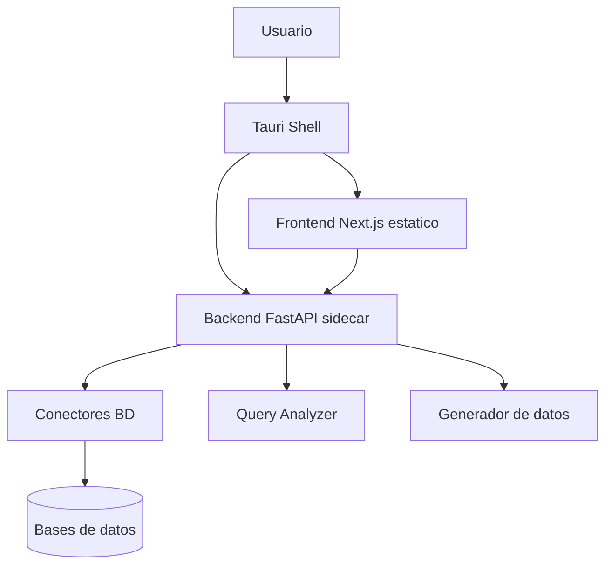

# FD04 - Informe de Arquitectura

<center>


**UNIVERSIDAD PRIVADA DE TACNA**  
**FluxSQL Desktop - Arquitectura de Software**

Integrantes: Kiara Zapana Murillo y Jefferson Vargas Espinoza  
Tacna - Peru, 2026

</center>

## Control de versiones

| Version | Hecha por | Fecha | Motivo |
| :-- | :-- | :-- | :-- |
| 1.0 | KHZM / JAVE | Junio 2026 | Arquitectura especifica de la rama `desktop` |

## 1. Introduccion

FluxSQL Desktop usa una arquitectura local compuesta por una interfaz web exportada, un contenedor nativo Tauri y un backend FastAPI ejecutado como sidecar. Esta arquitectura permite entregar una aplicacion instalable que procesa conexiones y credenciales en el equipo del usuario.

## 2. Vista general



## 3. Componentes

| Componente | Ruta | Responsabilidad |
| :-- | :-- | :-- |
| Frontend | `frontend-app/` | UI, rutas protegidas, editor, generador y analizador |
| Tauri | `frontend-app/src-tauri/` | Ventana nativa, comandos, ciclo de vida del backend e instalador |
| Backend | `backend-python/` | API local FastAPI |
| Conectores | `backend-python/backend/connectors/` | Conexion e inspeccion por motor |
| Analizador | `backend-python/query_analyzer/` | Analisis de consultas y metricas |
| Persistencia local | AppData | SQLite, logs y archivos locales |

## 4. Vista de despliegue

```text
Equipo Windows
  FluxSQL Desktop.exe
    Tauri runtime
    Frontend estatico out/
    Sidecar backend Python empaquetado
    Datos locales en %APPDATA%/com.fluxsql.desktop
```

## 5. Flujo de inicio

1. El usuario abre FluxSQL Desktop.
2. Tauri crea la ventana principal.
3. Tauri inicia el sidecar FastAPI en un puerto local dinamico.
4. Tauri espera respuesta de `/health`.
5. El frontend consume la API local.
6. Al cerrar la aplicacion, Tauri termina el proceso backend.

## 6. Motores soportados

- PostgreSQL.
- MySQL.
- SQL Server.
- MongoDB.
- Neo4j.
- Cassandra.

## 7. Decisiones arquitectonicas

| Decision | Justificacion |
| :-- | :-- |
| Tauri en lugar de Electron | Menor peso y mejor control nativo |
| FastAPI como sidecar | Rapidez de desarrollo y ecosistema Python para conectores |
| Frontend exportado | El instalador final no depende de servidor Next.js |
| Procesamiento local | Reduce riesgo de exponer credenciales |
| Conectores separados | Facilita mantener motores de BD independientes |

## 8. Relacion con `main`

La rama `main` conserva la arquitectura Web: Next.js, Supabase/Drizzle, dashboard colaborativo y despliegue cloud. La rama `desktop` adapta la experiencia a un contexto local: Tauri, FastAPI, conectores directos y empaquetado. Ambas comparten el objetivo conceptual de transformar esquemas en diagramas.

## 9. Trazabilidad historica

La arquitectura Desktop forma parte del repositorio oficial luego de integrar los historiales de `iovargasjeff/fluxsql` y `iovargasjeff/fluxsql-web`, evitando perdida de commits usados como evidencia academica.
