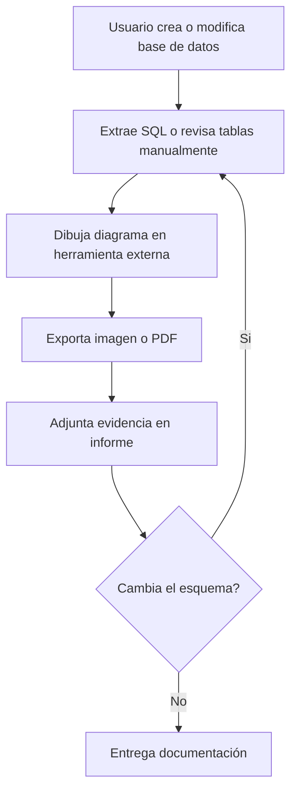
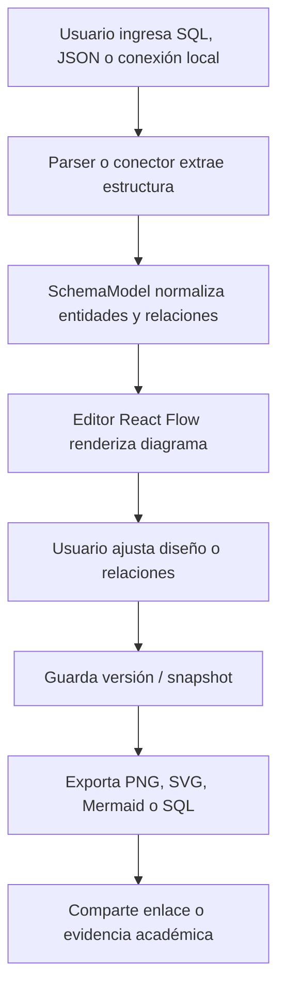
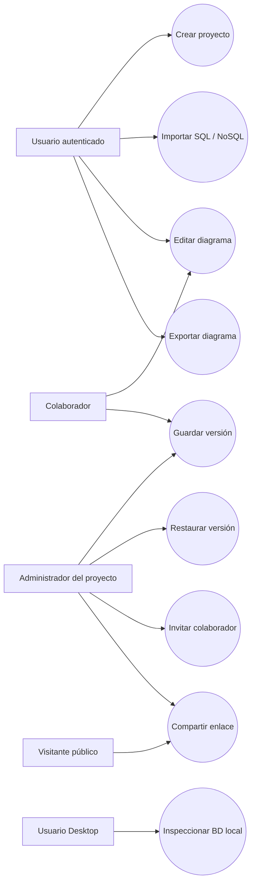

<center>


**UNIVERSIDAD PRIVADA DE TACNA**

**FACULTAD DE INGENIERÍA**

**Escuela Profesional de Ingeniería de Sistemas**

**Proyecto *DBCanvas — Generador de Diagramas de Base de Datos***

Curso: *Base de Datos II*

Docente: *Mag. Patrick Cuadros Quiroga*

Integrantes:

***Zapana Murillo, Kiara Holly (2023077087)***

***Vargas Espinoza, Jefferson Alfonso (2023076820)***

**Tacna – Perú**

***2026***

</center>

***

Sistema *DBCanvas — Database Diagram Generator*

Informe de Especificación de Requerimientos

Versión *1.0*

| CONTROL DE VERSIONES | | | | | |
| :-: | :- | :- | :- | :- | :- |
| Versión | Hecha por | Revisada por | Aprobada por | Fecha | Motivo |
| 1.0 | KHZM / JAVE | | | Abril 2026 | Versión Original |
| 1.1 | KHZM / JAVE | | | Junio 2026 | Actualización de requerimientos por variante |

***

## Nota de Actualización - Junio 2026

Los requerimientos se interpretan en dos superficies de entrega. La rama `main` cubre los requerimientos de la **Web App**: autenticación, dashboard, proyectos, editor, versiones, colaboración, enlaces públicos y exportación. La rama `desktop` cubre los requerimientos de la **Desktop App**: ejecución local, conectores directos, inspección de esquemas, generación de diagramas, generación de datos y análisis de consultas. Esta separación permite mantener trazabilidad académica sin mezclar la implementación web con el empaquetado de escritorio.

## ÍNDICE GENERAL

1. Introducción
    - 1.1 Propósito
    - 1.2 Alcance
    - 1.3 Definiciones, Siglas y Abreviaturas
    - 1.4 Referencias
2. Descripción General
    - 2.1 Perspectiva del Producto
    - 2.2 Funciones del Producto
    - 2.3 Características de los Usuarios
    - 2.4 Restricciones
3. Requerimientos Específicos
    - 3.1 Requisitos Funcionales
    - 3.2 Requisitos No Funcionales
    - 3.3 Requisitos de Interfaces
    - 3.4 Modelo Lógico de Datos

***

## 1. Introducción

### 1.1 Propósito

El presente documento describe los requisitos funcionales y no funcionales del sistema **DBCanvas — Generador de Diagramas de Base de Datos**. Su objetivo es servir como contrato funcional entre los desarrolladores y los interesados, especificando el comportamiento exacto que tendrá el software en sus dos superficies (Web App y Desktop App).

El alcance funcional se centra exclusivamente en la **generación, visualización y exportación de diagramas** a partir de esquemas de bases de datos de cualquier tipo.

### 1.2 Alcance

DBCanvas es un **generador de diagramas de base de datos**. No es un gestor de bases de datos, no modifica esquemas, no ejecuta queries sobre los datos del usuario. Su única función es:

1. **Recibir un esquema** (vía texto DDL, archivo JSON, o conexión directa a una BD).
2. **Convertirlo a un modelo intermedio universal** (`SchemaModel`).
3. **Renderizar un diagrama visual** (ERD u otro tipo según la categoría de BD).
4. **Exportar el resultado** (PNG, SVG, Mermaid `.mmd`).

La solución abarca **9 categorías de bases de datos** mediante tres mecanismos de entrada:

| Mecanismo de entrada | Categorías que cubre | Superficie |
| :-- | :-- | :-- |
| **Parser SQL DDL** (TypeScript, client-side) | Relacional, NewSQL, Columnar (CQL≈SQL), Spatial, Time-Series (TimescaleDB) | Web + Desktop |
| **Parser JSON Schema** (TypeScript, client-side) | Document DB, Key-Value, Object-Oriented | Web + Desktop |
| **Conectores directos Go** (lectura de `information_schema`, `PRAGMA`, aggregations) | PostgreSQL, MySQL, SQLite, MongoDB, SQL Server | Desktop |

### 1.3 Definiciones, Siglas y Abreviaturas

- **ERD:** Diagrama Entidad-Relación.
- **SQL DDL:** Data Definition Language — instrucciones para definir estructuras (`CREATE TABLE`, `ALTER TABLE`).
- **SchemaModel:** Modelo intermedio universal que representa entidades y relaciones de cualquier tipo de base de datos.
- **CQL:** Cassandra Query Language, sintácticamente similar a SQL.
- **SPA:** Single Page Application.
- **Monorepo:** Repositorio único que almacena múltiples proyectos o paquetes.

### 1.4 Referencias

- FD01 — Informe de Factibilidad de DBCanvas (v1.0)
- FD02 — Documento de Visión de DBCanvas (v1.0)
- Infografía "Types of Databases" — Material del aula virtual, curso Base de Datos II

***

## 2. Descripción General

### 2.1 Perspectiva del Producto

DBCanvas opera como un **pipeline de transformación de datos unidireccional**:

```
[Fuente de entrada] → [SchemaModel] → [Generador Mermaid] → [Diagrama Visual]
```

El sistema **solo lee** la estructura de la base de datos. Nunca modifica, inserta ni elimina datos en la base de datos del usuario. La operación es de solo lectura (DQL/Schema), lo cual garantiza seguridad total.

Para la **Web App**, los diagramas generados pueden persistirse opcionalmente en una base de datos PostgreSQL en la nube (gestionada con `@insforge/cli`), permitiendo guardar, compartir y colaborar en tiempo real sobre los diagramas.

### 2.2 Funciones del Producto

A alto nivel, el software permite:

1. **Parsear texto estructurado** (SQL DDL, JSON Schema, CQL) y convertirlo en un `SchemaModel`.
2. **Conectarse a bases de datos reales** (solo lectura) para extraer su estructura automáticamente.
3. **Renderizar diagramas** ERD en tiempo real usando Mermaid.js.
4. **Exportar el diagrama** a PNG, SVG, `.mmd` y SQL DDL formateado.
5. **Guardar y compartir diagramas** en la nube (exclusivo Web App).

### 2.3 Características de los Usuarios

| Tipo de Usuario | Necesidad Principal | Superficie |
| :-- | :-- | :-- |
| **Desarrollador de software** | Visualizar rápidamente el esquema de su BD de producción sin instalar herramientas pesadas | Desktop |
| **Estudiante de BD** | Pegar un `CREATE TABLE` de su tarea y obtener el diagrama ERD al instante | Web |
| **Arquitecto de software** | Generar diagramas actualizados de BD complejas para revisiones de diseño | Desktop / Web |
| **Docente** | Usar la herramienta como material didáctico para enseñar modelado de datos | Web |

### 2.4 Restricciones

- El sistema **solo lee** la estructura de la base de datos. No realiza operaciones de escritura sobre la BD del usuario.
- El parser SQL DDL cubre las variantes más frecuentes de `CREATE TABLE`. Dialectos muy exóticos pueden no ser soportados.
- Los conectores directos (Desktop) requieren que el usuario tenga acceso de red a la BD objetivo.

***

## 3. Requerimientos Específicos

### 3.1 Requisitos Funcionales (RF)

#### Módulo Core — Generación de Diagramas

| ID | Nombre | Descripción | Superficie | Prioridad |
| :-- | :-- | :-- | :-- | :--: |
| **RF01** | Parser SQL DDL → SchemaModel | El sistema debe recibir texto SQL DDL (variantes PostgreSQL, MySQL, SQL Server, CQL) y producir un `SchemaModel` con entidades, atributos y relaciones en tiempo real (debounce ≤ 300 ms). | Web / Desktop | Alta |
| **RF02** | Parser JSON Schema → SchemaModel | El sistema debe recibir un JSON Schema o documento de ejemplo y producir un `SchemaModel` infiriendo entidades y atributos (incluyendo estructuras anidadas). | Web / Desktop | Alta |
| **RF03** | Renderizado Mermaid en tiempo real | El `SchemaModel` debe convertirse automáticamente a sintaxis Mermaid ERD y renderizarse como SVG interactivo en el canvas del diagrama, actualizándose con cada cambio. | Web / Desktop | Alta |
| **RF04** | Exportación multi-formato | El usuario debe poder exportar el diagrama generado a PNG, SVG, `.mmd` (Mermaid) y SQL DDL formateado con un solo clic. | Web / Desktop | Alta |
| **RF05** | Selección de entidades | El usuario debe poder seleccionar/deseleccionar entidades del `SchemaModel` para controlar qué tablas aparecen en el diagrama (componente `TableSelector`). | Web / Desktop | Media |
| **RF06** | Galería de plantillas visuales | El sistema debe ofrecer al menos 4 plantillas de estilo visual para el diagrama (colores, layout). | Web / Desktop | Baja |

#### Módulo Desktop — Conectores de Base de Datos

| ID | Nombre | Descripción | Superficie | Prioridad |
| :-- | :-- | :-- | :-- | :--: |
| **RF07** | Conector PostgreSQL | Conexión directa vía `lib/pq`, lectura de `information_schema` para extraer tablas, columnas, PKs, FKs y generar el `SchemaModel`. | Desktop | Alta |
| **RF08** | Conector MySQL | Conexión directa vía `go-sql-driver/mysql`, lectura de `information_schema`. | Desktop | Alta |
| **RF09** | Conector SQLite | Conexión directa vía `go-sqlite3`, lectura de `PRAGMA table_info` y `PRAGMA foreign_key_list`. | Desktop | Alta |
| **RF10** | Conector MongoDB | Conexión vía `mongo-driver`, inferencia de esquema mediante sampling de 100 documentos con `$sample` y reglas de frecuencia (≥20%). | Desktop | Alta |
| **RF11** | Conector SQL Server | Conexión vía `go-mssqldb`, lectura de `information_schema`. | Desktop | Media |
| **RF12** | Formulario de conexión | Interfaz visual con campos para host, puerto, usuario, contraseña y nombre de BD, con validación en tiempo real y botón de "Test Connection". | Desktop | Alta |

#### Módulo Web — Persistencia y Colaboración

| ID | Nombre | Descripción | Superficie | Prioridad |
| :-- | :-- | :-- | :-- | :--: |
| **RF13** | Registro e inicio de sesión | El sistema debe permitir crear cuentas con email y contraseña (hash bcrypt) en la tabla `usuarios`, independiente del auth del BaaS. | Web | Alta |
| **RF14** | Guardado de diagramas | Los usuarios autenticados podrán guardar, nombrar, organizar en proyectos y listar sus diagramas. | Web | Alta |
| **RF15** | Colaboración en tiempo real | Los cambios en el editor de un diagrama compartido deben propagarse por WebSockets a todos los colaboradores conectados. | Web | Media |
| **RF16** | Importar archivo | El usuario debe poder arrastrar o seleccionar un archivo `.sql`, `.json` o `.mmd` para generar el diagrama directamente. | Web / Desktop | Media |

### 3.2 Requisitos No Funcionales (RNF)

| ID | Categoría | Descripción |
| :-- | :-- | :-- |
| **RNF01** | Desempeño | El parseo del DDL y la regeneración del SVG debe completarse en ≤ 500 ms para esquemas de hasta 50 tablas. |
| **RNF02** | Privacidad (Desktop) | La aplicación de escritorio opera 100% local. Ningún dato del esquema del usuario se transmite a servidores externos. |
| **RNF03** | Portabilidad (Web) | La base de datos PostgreSQL en la nube debe estructurarse sin dependencias propietarias, siendo migrable con `pg_dump` a cualquier otro PostgreSQL. |
| **RNF04** | Usabilidad | Exportar un diagrama tras su generación no debe requerir más de 2 clics. |
| **RNF05** | Compatibilidad | La Web App debe funcionar en Chrome 100+, Firefox 100+, Safari 16+ y Edge 100+. |
| **RNF06** | Extensibilidad | La interfaz `Connector` en Go y el sistema de parsers en TypeScript deben ser extensibles para agregar nuevos motores o dialectos sin modificar el código existente. |

### 3.3 Requisitos de Interfaces

- **Interfaces de Usuario (UI):** Componentes React construidos con Shadcn/UI + TailwindCSS. Pantallas: `Editor + Canvas` (principal), `Connection Modal` (Desktop), `Login/Register` (Web), `Workspace / Projects` (Web).
- **Interfaces de Software:**
  - Editor de código: Monaco Editor (`@monaco-editor/react`) con syntax highlighting para SQL y JSON.
  - Renderer de diagramas: Mermaid.js para generar SVG interactivo.
  - Conectores: Drivers nativos Go para cada motor de BD.
  - Persistencia Web: SDK de `@insforge/cli` para PostgreSQL con real-time.

### 3.4 Modelo Lógico de Datos

#### SchemaModel (modelo intermedio universal — `packages/parsers`)

```typescript
interface SchemaModel {
  entities: Entity[];
  relationships: Relationship[];
  metadata?: { sourceType: string; parsedAt: string; };
}

interface Entity {
  name: string;
  attributes: Attribute[];
  primaryKey?: string[];
}

interface Attribute {
  name: string;
  type: string;
  nullable: boolean;
  isPrimaryKey: boolean;
  isForeignKey: boolean;
  references?: { entity: string; attribute: string; };
}

interface Relationship {
  from: string;
  to: string;
  type: 'one-to-one' | 'one-to-many' | 'many-to-many';
  label?: string;
}
```

#### Base de datos Web App (PostgreSQL — `@insforge/cli`)

- `usuarios`: `id (UUID PK)`, `email`, `password_hash`, `nombre`, `avatar_url`, `created_at`, `updated_at`
- `proyectos`: `id (UUID PK)`, `usuario_id (FK)`, `nombre`, `descripcion`, `created_at`, `updated_at`
- `diagramas`: `id (UUID PK)`, `proyecto_id (FK)`, `usuario_id (FK)`, `nombre`, `tipo_fuente`, `contenido_fuente`, `schema_json (JSONB)`, `mermaid_code`, `config (JSONB)`, `created_at`, `updated_at`
- `colaboradores`: `id (UUID PK)`, `diagrama_id (FK)`, `usuario_id (FK)`, `permiso`, `created_at`

## 4. Complemento SRS según Plantilla de Referencia

El documento de referencia FD03 incluye contexto organizacional, levantamiento de información, procesos actual/propuesto, reglas de negocio, perfiles de usuario, casos de uso narrados y diagramas UML. Para fortalecer este SRS se agregan las siguientes secciones.

### 4.1 Contexto del proyecto

| Elemento | Descripción |
| :-- | :-- |
| Nombre del sistema | FluxSQL - Generador de Diagramas de Base de Datos |
| Dominio | Herramientas académicas y técnicas para documentación de bases de datos |
| Usuarios principales | Estudiantes, docentes, desarrolladores y equipos que modelan bases de datos |
| Problema central | La documentación de esquemas se realiza manualmente, se desactualiza rápido y no siempre conserva evidencia de cambios |
| Solución propuesta | Generación visual de diagramas desde SQL/NoSQL, control de versiones, colaboración y variante Desktop local |

### 4.2 Hallazgos del levantamiento de información

| ID | Hallazgo | Impacto |
| :-- | :-- | :-- |
| H-01 | Los diagramas ERD suelen crearse manualmente en herramientas externas. | Mayor tiempo de documentación y riesgo de errores. |
| H-02 | Los cambios de esquema no siempre quedan trazados. | Dificulta justificar avance académico o técnico. |
| H-03 | El despliegue desde organizaciones puede generar restricciones. | Se requiere fork personal para despliegue Vercel. |
| H-04 | Las conexiones reales de BD requieren manejo seguro de credenciales. | Se justifica una variante Desktop local. |

### 4.3 Proceso actual



### 4.4 Proceso propuesto



### 4.5 Requerimientos funcionales finales

| ID | Nombre | Descripción | Actor | Prioridad |
| :-- | :-- | :-- | :-- | :--: |
| RFF-01 | Crear proyecto | El usuario autenticado debe crear un proyecto de diagrama. | Administrador Web | Alta |
| RFF-02 | Parsear SQL DDL | El sistema debe transformar DDL PostgreSQL, MySQL o SQL Server en nodos. | Usuario técnico | Alta |
| RFF-03 | Parsear modelos NoSQL | El sistema debe transformar MongoDB/Neo4j en nodos y relaciones visuales. | Usuario técnico | Media |
| RFF-04 | Editar diagrama visual | El usuario debe mover nodos, revisar atributos y relaciones. | Administrador / Colaborador | Alta |
| RFF-05 | Guardar versiones | El sistema debe registrar snapshots con mensaje de cambio. | Administrador / Colaborador | Alta |
| RFF-06 | Restaurar versiones | El sistema debe permitir volver a un snapshot anterior. | Administrador / Colaborador | Media |
| RFF-07 | Compartir enlace público | El sistema debe generar vista pública de lectura o edición según permiso. | Administrador | Alta |
| RFF-08 | Invitar colaboradores | El sistema debe registrar invitaciones por correo y rol. | Administrador | Alta |
| RFF-09 | Exportar diagrama | El sistema debe exportar PNG, SVG, Mermaid y SQL. | Usuario técnico | Alta |
| RFF-10 | Ejecutar variante Desktop | La app Desktop debe inspeccionar esquemas desde el equipo del usuario. | Usuario Desktop | Media |

### 4.6 Requerimientos no funcionales ampliados

| ID | Descripción | Prioridad |
| :-- | :-- | :--: |
| RNF-01 | El build de producción de la Web App debe completar sin errores TypeScript. | Alta |
| RNF-02 | Las variables `.env` no deben versionarse en GitHub. | Alta |
| RNF-03 | Los binarios Desktop generados no deben subirse al repositorio. | Alta |
| RNF-04 | La vista pública no debe exponer proyectos privados. | Alta |
| RNF-05 | El editor debe responder de forma fluida con diagramas medianos. | Media |
| RNF-06 | Los documentos FD deben mantenerse en Markdown y ser legibles en GitHub. | Alta |

### 4.7 Reglas de negocio

| ID RN | Regla | Condición | Validación | Resultado esperado |
| :-- | :-- | :-- | :-- | :-- |
| RN-01 | Todo proyecto debe tener propietario. | Creación de proyecto | `ownerId` obligatorio | Proyecto asociado a usuario creador |
| RN-02 | Solo owner/editor puede guardar versiones. | Commit de versión | Validar colaborador y rol | Snapshot creado o error de permisos |
| RN-03 | Vista pública requiere diagrama marcado como público. | Acceso `/public/[id]` | `isPublic = true` | Se muestra diagrama o `notFound` |
| RN-04 | Invitación debe usar rol válido. | Crear invitación | Rol `editor` o `viewer` | Invitación registrada |
| RN-05 | Fork personal se usa para Vercel. | Despliegue Web | Repo `iovargasjeff/fluxsql` | Deploy independiente de la org |

### 4.8 Diagrama de casos de uso



### 4.9 Narrativa de casos de uso

| Atributo | UC-01 Crear y versionar diagrama |
| :-- | :-- |
| Actor principal | Usuario autenticado |
| Propósito | Crear un proyecto, importar estructura y guardar un snapshot verificable. |
| Precondición | Usuario con sesión iniciada. |
| Flujo básico | Crear proyecto -> importar SQL/NoSQL -> revisar diagrama -> guardar versión. |
| Postcondición | Proyecto y versión quedan persistidos en la base de datos. |

| Atributo | UC-02 Compartir diagrama público |
| :-- | :-- |
| Actor principal | Administrador del proyecto |
| Propósito | Permitir que un tercero vea o edite el diagrama mediante enlace. |
| Precondición | Proyecto existente y usuario con rol owner/editor. |
| Flujo básico | Abrir proyecto -> activar público -> seleccionar permiso -> copiar enlace. |
| Postcondición | El enlace `/public/[id]` queda disponible según `shareAccess`. |

| Atributo | UC-03 Inspeccionar base local en Desktop |
| :-- | :-- |
| Actor principal | Usuario Desktop |
| Propósito | Generar diagrama desde una base local sin enviar credenciales a la nube. |
| Precondición | App Desktop instalada y motor de BD accesible. |
| Flujo básico | Abrir app -> configurar conexión -> probar conexión -> inspeccionar esquema -> generar diagrama. |
| Postcondición | Diagrama generado localmente y exportable. |
