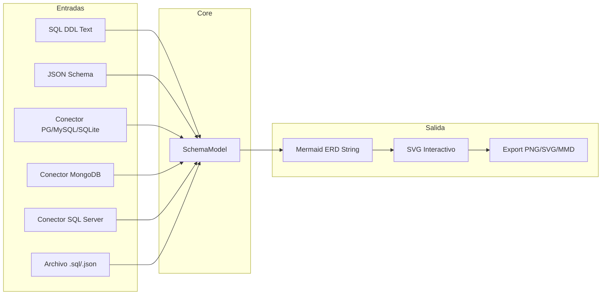
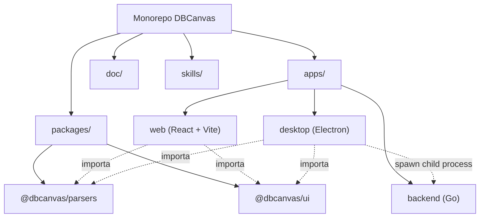
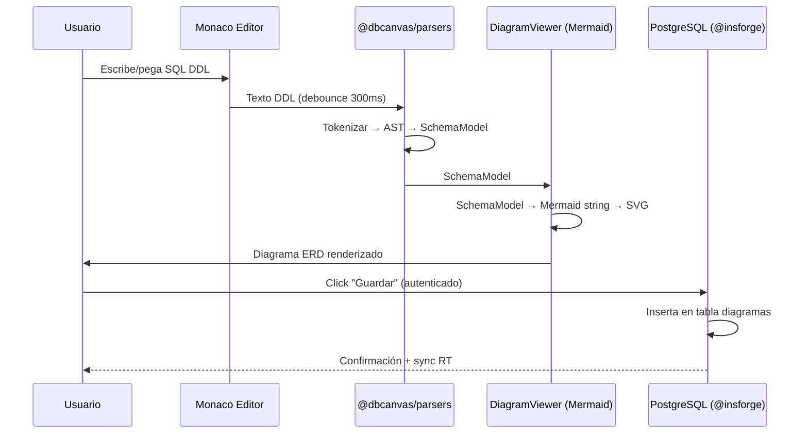
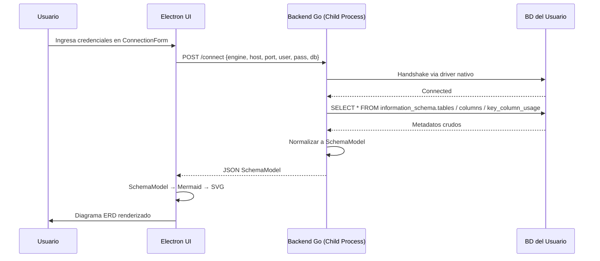
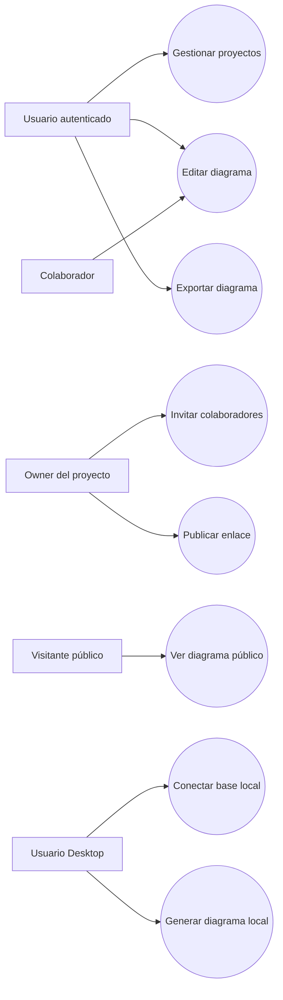
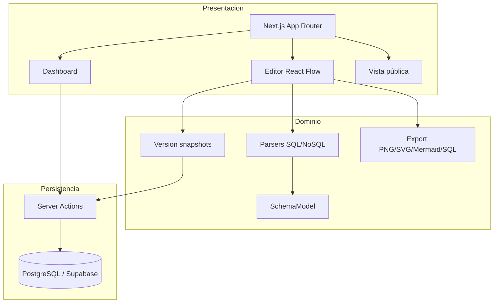
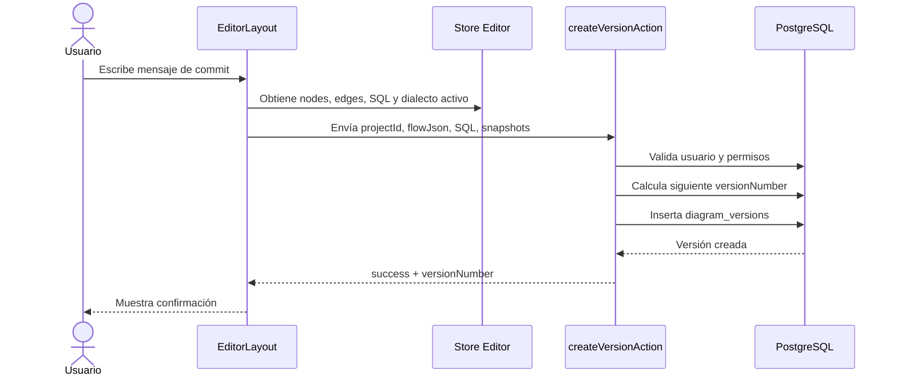
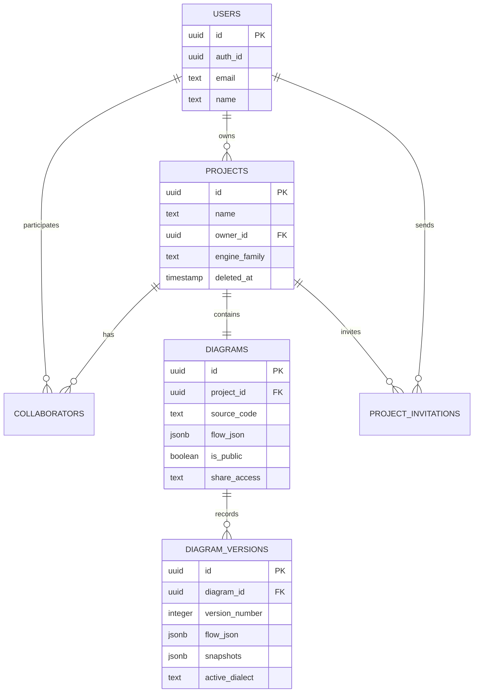
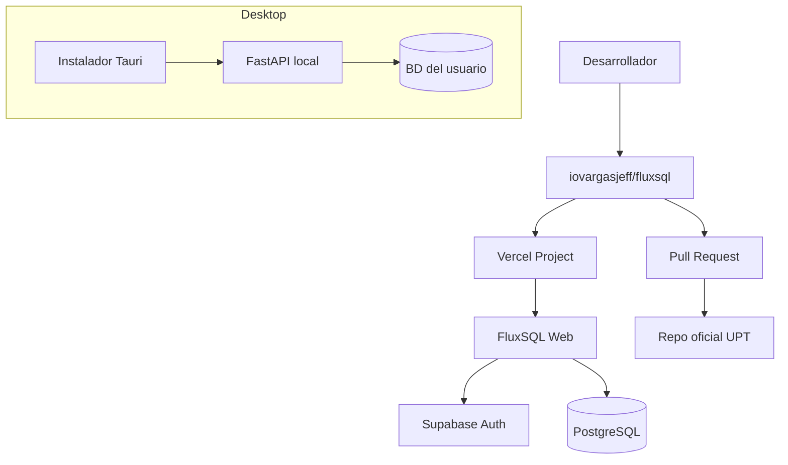

<center>


**UNIVERSIDAD PRIVADA DE TACNA**

**FACULTAD DE INGENIERÍA**

**Escuela Profesional de Ingeniería de Sistemas**

**Proyecto *DBCanvas — Generador de Diagramas de Base de Datos***

Curso: *Base de Datos II*

Docente: *Mag. Patrick Cuadros Quiroga*

Integrantes:

***Zapana Murillo, Kiara Holly (2023077087)***

***Vargas Espinoza, Jefferson Alfonso (2023076820)***

**Tacna – Perú**

***2026***

</center>

***

Sistema *DBCanvas — Database Diagram Generator*

Informe de Arquitectura de Software

Versión *1.0*

| CONTROL DE VERSIONES | | | | | |
| :-: | :- | :- | :- | :- | :- |
| Versión | Hecha por | Revisada por | Aprobada por | Fecha | Motivo |
| 1.0 | KHZM / JAVE | | | Abril 2026 | Versión Original |
| 1.1 | KHZM / JAVE | | | Junio 2026 | Actualización de arquitectura Web/Desktop |

***

## Nota de Actualización - Junio 2026

La arquitectura final se documenta como una arquitectura de dos variantes. En `main`, FluxSQL Web usa Next.js, componentes React, acciones server-side, Drizzle/Supabase y despliegue Vercel. En `desktop`, FluxSQL Desktop usa Tauri, frontend Next.js exportado estáticamente y backend FastAPI local como sidecar. La arquitectura conceptual `Entrada -> SchemaModel -> Diagrama` se mantiene vigente y permite compartir criterios de modelado entre ambas variantes.

## ÍNDICE GENERAL

1. Introducción
2. Representación Arquitectónica
3. Metas y Restricciones Arquitectónicas
4. Vista Lógica
5. Vista de Procesos
6. Vista de Despliegue

***

## 1. Introducción

### 1.1 Propósito

Este documento proporciona una visión completa de la arquitectura del sistema **DBCanvas — Generador de Diagramas de Base de Datos**. Describe las decisiones de diseño que permiten al sistema recibir esquemas de **9 categorías distintas de bases de datos** y producir diagramas visuales de forma rápida, segura y extensible.

### 1.2 Alcance

Se describen la arquitectura de transformación de datos (pipeline `Entrada → SchemaModel → Diagrama`), la estructura del monorepo, la separación entre parsers client-side y conectores server-side, y la infraestructura de persistencia en la nube para la Web App.

***

## 2. Representación Arquitectónica

### 2.1 Patrón Central: Pipeline de Transformación Unidireccional

La decisión arquitectónica más importante del sistema es que **toda fuente de entrada se convierte a un modelo intermedio universal (`SchemaModel`)** antes de renderizar el diagrama. Esto desacopla completamente las entradas (parsers, conectores) de la salida (Mermaid.js).



**¿Por qué este patrón?**
- **Extensibilidad:** Para soportar un nuevo tipo de BD, solo se agrega un nuevo parser o conector que produzca un `SchemaModel`. **No se toca el renderer.**
- **Testabilidad:** Cada parser se prueba de forma aislada: entrada conocida → `SchemaModel` esperado.
- **Reutilización:** El mismo `SchemaModel` sirve para Web App y Desktop App.

### 2.2 Estilo Arquitectónico: Monorepo con Packages Compartidos



| Paquete | Responsabilidad | Lenguaje |
| :-- | :-- | :-- |
| `packages/parsers` | Parsers puros: SQL DDL → SchemaModel, JSON Schema → SchemaModel. Sin dependencias de browser ni Node.js. | TypeScript |
| `packages/ui` | Componentes React compartidos: `DiagramViewer`, `CodeEditor`, `TableSelector`, `ConnectionForm` | TypeScript / React |
| `apps/web` | Web App React. Usa parsers client-side. Persiste diagramas en PostgreSQL vía `@insforge/cli`. | TypeScript |
| `apps/desktop` | Electron shell. Usa los mismos componentes UI. Se comunica con `apps/backend` vía HTTP local. | TypeScript |
| `apps/backend` | Servidor HTTP Go. Conectores nativos para PG, MySQL, SQLite, MongoDB, SQL Server. Retorna `SchemaModel` como JSON. | Go |

***

## 3. Metas y Restricciones Arquitectónicas

| Meta / Restricción | Descripción |
| :-- | :-- |
| **Solo lectura** | El sistema NUNCA modifica la base de datos del usuario. Solo lee metadatos (`information_schema`, `PRAGMA`, aggregations). |
| **Privacidad local (Desktop)** | Ningún dato del esquema del usuario sale de su máquina en la versión Desktop. El backend Go corre como proceso local. |
| **Sin vendor lock-in (Web)** | La tabla `usuarios` con credenciales propias permite migrar de `@insforge/cli` a cualquier PostgreSQL con un `pg_dump`. |
| **Extensibilidad por plugins** | Agregar soporte para un nuevo motor de BD = implementar la interfaz `Connector` en Go (Desktop) o un nuevo parser en TypeScript (Web). |
| **9 categorías de BD** | Cubrir Relacional, Document, Key-Value, Graph, Columnar, Time-Series, NewSQL, Spatial y Object-Oriented mediante la combinación de parsers SQL DDL + JSON Schema + conectores. |

***

## 4. Vista Lógica

### 4.1 Vista de Interacción — Web App (Parsing Client-Side)



**Punto clave:** En la Web App, **todo el parseo ocurre en el navegador del usuario**. El servidor solo se usa para guardar/compartir diagramas, no para procesar esquemas.

### 4.2 Vista de Interacción — Desktop App (Conexión Directa a BD)



**Punto clave:** El backend Go SOLO extrae metadatos (estructura). **Nunca lee datos de las tablas del usuario.** Las credenciales viven en memoria RAM y se descartan al cerrar.

***

## 5. Vista de Procesos

### 5.1 Cobertura de 9 Categorías de Base de Datos

| Categoría | Mecanismo de entrada | Cómo genera el diagrama |
| :-- | :-- | :-- |
| **Relational** (MySQL, PG, Oracle, SQL Server, SQLite) | Conector directo (Desktop) + Parser DDL (Web) | ERD clásico: tablas, columnas, PKs, FKs |
| **NewSQL** (CockroachDB, TiDB, YugaByte) | Usan protocolo PG o MySQL → mismos conectores | ERD idéntico al relacional |
| **Spatial** (PostGIS) | Extensión de PostgreSQL → mismo conector PG | ERD + columnas de tipo geometry |
| **Time-Series** (TimescaleDB) | Extensión de PostgreSQL → mismo conector PG | ERD con hypertables como entidades |
| **Columnar** (Cassandra, ClickHouse) | Parser CQL/SQL (≈ SQL estándar) vía parser DDL | ERD con column families |
| **Document** (MongoDB, CouchDB) | Conector MongoDB (Desktop) + Parser JSON Schema (Web) | ERD inferido: colecciones como entidades, campos como atributos |
| **Key-Value** (Redis, DynamoDB) | Parser JSON Schema (formato de definición) | Diagrama simple: stores con key/value types |
| **Graph** (Neo4j) | Parser Cypher `CREATE` (extensión futura) o JSON de nodos/aristas | Diagrama de nodos y relaciones |
| **Object-Oriented** (ZODB, db4o) | Parser JSON/YAML de definición de clases | Diagrama de clases: herencia y composición |

***

## 6. Vista de Despliegue

### 6.1 Web App

```
Usuario (Navegador)
  └── React SPA (Vite build estático)
        ├── @dbcanvas/parsers (ejecuta en browser)
        ├── @dbcanvas/ui (componentes React)
        └── SDK @insforge/cli → PostgreSQL Cloud
              ├── tabla: usuarios
              ├── tabla: proyectos
              ├── tabla: diagramas
              └── tabla: colaboradores
```

### 6.2 Desktop App

```
Usuario (Windows / macOS / Linux)
  └── Electron App (instalador nativo)
        ├── React UI (mismos componentes @dbcanvas/ui)
        ├── @dbcanvas/parsers (para DDL pegado manualmente)
        └── Go Backend (child process, puerto dinámico)
              ├── Conector PostgreSQL
              ├── Conector MySQL
              ├── Conector SQLite
              ├── Conector MongoDB
              └── Conector SQL Server
```

No se requiere servidor dedicado, infraestructura cloud ni hardware especializado para el uso del Desktop. La Web App utiliza PostgreSQL gestionado por `@insforge/cli` exclusivamente para persistencia de diagramas y autenticación.

## 7. Complemento SAD según Plantilla de Referencia

El documento de referencia FD04 organiza la arquitectura en vistas: casos de uso, lógica, implementación, procesos, despliegue y atributos de calidad. A continuación se agregan esas vistas para FluxSQL.

### 7.1 Priorización de requerimientos arquitectónicos

| ID | Requerimiento | Prioridad | Decisión arquitectónica |
| :-- | :-- | :--: | :-- |
| RFF-02 | Parsear SQL DDL | Alta | Parsers por dialecto en `frontend-app/lib/parsers`. |
| RFF-04 | Editar diagrama visual | Alta | React Flow con nodos customizados. |
| RFF-05 | Guardar versiones | Alta | Tabla `diagram_versions` con snapshots por dialecto. |
| RFF-07 | Compartir enlace público | Alta | Ruta dinámica `/public/[id]` y banderas `isPublic/shareAccess`. |
| RFF-10 | Inspección Desktop | Media | Tauri + FastAPI local en rama `desktop`. |

### 7.2 Vista de casos de uso



### 7.3 Vista lógica por subsistemas



### 7.4 Diagrama de secuencia - guardar versión



### 7.5 Diagrama de base de datos



### 7.6 Vista de despliegue actualizada



### 7.7 Atributos de calidad

| Atributo | Escenario | Respuesta del sistema | Métrica / meta |
| :-- | :-- | :-- | :-- |
| Funcionalidad | Usuario importa DDL PostgreSQL | Parser genera nodos y relaciones | Diagrama visible sin edición manual obligatoria |
| Usabilidad | Usuario nuevo abre dashboard | Puede crear proyecto desde CTA claro | Primer proyecto en menos de 2 minutos |
| Seguridad | Acceso a diagrama privado | Ruta pública valida `isPublic` | No se muestra si no está publicado |
| Rendimiento | Diagrama mediano con 50 tablas | Canvas sigue siendo navegable | Interacción fluida en navegador moderno |
| Mantenibilidad | Se agrega nuevo dialecto | Se crea parser aislado y se registra en `index.ts` | Sin modificar componentes centrales |
